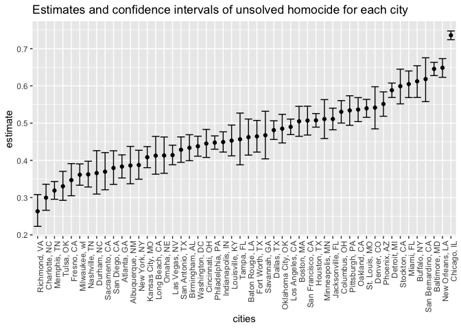

p8105_hw5_yl4610
================
2022-11-08

``` r
library(tidyverse)
```

# problem 1

# problem 2

``` r
homicide_raw = read_csv( "./data/homicide_data.csv") 
```

This dataset contains variables such as uid, reported_date, victim_last,
victim_first, victim_race, victim_age, victim_sex, city, state, lat,
lon, disposition. It contains 12 columns and 52179 rows.

``` r
homicide = 
homicide_raw %>% 
  mutate (
    city_state = str_c(city, ", ", state),
    city_state = ifelse(city_state == "Tulsa, AL", "Tulsa, OK", city_state)) %>%
  group_by(city_state) %>% 
  summarize(
    total_homicides = n(),
    unsolved_homicides = sum(disposition !="Closed by arrest"))

homicide
```

I used mutate to create a city_state variable. Then I used group_by and
summarize to summarize within cities to obtain the total number of
homicides and the number of unsolved homicides.

``` r
baltimore = 
  homicide %>% 
  filter(city_state == "Baltimore, MD") 

prop.test(
  baltimore$unsolved_homicides,baltimore$total_homicides) %>% 
  broom::tidy()
```

    ## # A tibble: 1 × 8
    ##   estimate statistic  p.value parameter conf.low conf.high method        alter…¹
    ##      <dbl>     <dbl>    <dbl>     <int>    <dbl>     <dbl> <chr>         <chr>  
    ## 1    0.646      239. 6.46e-54         1    0.628     0.663 1-sample pro… two.si…
    ## # … with abbreviated variable name ¹​alternative

I used filter to filter out other city_state except “Baltimore, MD”.
Then I used prop.test function to estimate the proportion of homicides
that are unsolved and applied the broom::tidy to pull the estimated
proportion and confidence intervals.

``` r
city_final = 
  homicide %>% 
  mutate(
    outputs_df = map2 (unsolved_homicides,total_homicides, prop.test),
    final_outputs_df = map(outputs_df, broom::tidy)) %>% 
  unnest(final_outputs_df) %>% 
  select (city_state, estimate, conf.low, conf.high)

city_final
```

    ## # A tibble: 50 × 4
    ##    city_state      estimate conf.low conf.high
    ##    <chr>              <dbl>    <dbl>     <dbl>
    ##  1 Albuquerque, NM    0.386    0.337     0.438
    ##  2 Atlanta, GA        0.383    0.353     0.415
    ##  3 Baltimore, MD      0.646    0.628     0.663
    ##  4 Baton Rouge, LA    0.462    0.414     0.511
    ##  5 Birmingham, AL     0.434    0.399     0.469
    ##  6 Boston, MA         0.505    0.465     0.545
    ##  7 Buffalo, NY        0.612    0.569     0.654
    ##  8 Charlotte, NC      0.300    0.266     0.336
    ##  9 Chicago, IL        0.736    0.724     0.747
    ## 10 Cincinnati, OH     0.445    0.408     0.483
    ## # … with 40 more rows

I used mutate to run prop.test for each of the cities and extract both
the proportion of unsolved homicides and the confidence interval for
each via purrr::map and purrr::map2. Then I unnested the
final_outputs_df and selected variables I wanted to create a tidy
dataframe with estimated proportions and CIs for each city.

``` r
city_plot = 
city_final %>% 
ggplot(aes(x=fct_reorder(city_state, estimate), y=estimate))+
  geom_point()+
  geom_errorbar(aes(ymin=conf.low, ymax=conf.high))+
  labs(
    title = "Estimates and confidence intervals of unsolved homocide for each city",
    x = "cities") +
  theme(axis.text.x = element_text(angle = 90, hjust = 1))

city_plot
```

<!-- --> I
used ggplot to create a scatter plot showing the estimates and CIs for
each city. I used geom_errorbar to add error bars based on the upper and
lower limits. I used fct_reorder to organize cities according to the
proportion of unsolved homicides. lastly, I used labs to add title and
x-axis label.

# problem 3
