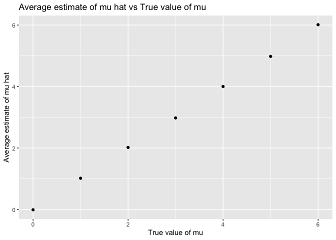
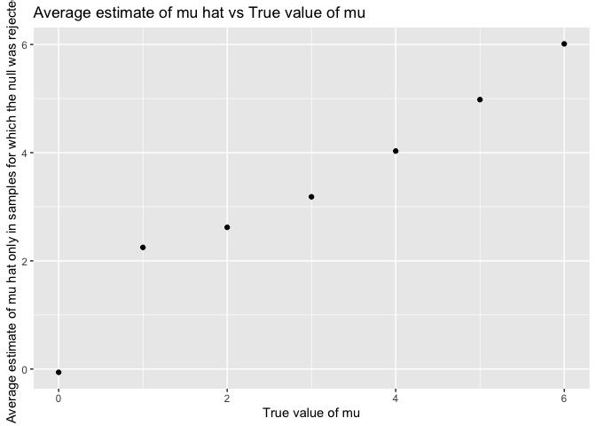

p8105_hw5_yl4610
================
Yuxin Liu
2022-11-08

``` r
library(tidyverse)
library(p8105.datasets)
library(viridis)
```

# problem 1

The code chunk below imports the data in individual spreadsheets
contained in `./data/Q1data/`. I create a dataframe that includes the
list of all files in that directory and the complete path to each file.
Then, I `map` over paths and import data using the `read_csv` function.
Finally, I `unnest` the result of `map`.

``` r
full_df = 
  tibble(
    files = list.files("data/Q1data/"),
    path = str_c("data/Q1data/", files)
  ) %>% 
  mutate(data = map(path, read_csv)) %>% 
  unnest()
```

The result of the previous code chunk isn’t tidy – data are wide rather
than long, and some important variables are included as parts of others.
The code chunk below tides the data using string manipulations on the
file, converting from wide to long, and selecting relevant variables.

``` r
tidy_df = 
  full_df %>% 
  mutate(
    files = str_replace(files, ".csv", ""),
    group = str_sub(files, 1, 3)) %>% 
  pivot_longer(
    week_1:week_8,
    names_to = "week",
    values_to = "outcome",
    names_prefix = "week_") %>% 
  mutate(week = as.numeric(week)) %>% 
  select(group, subj = files, week, outcome)
```

I created a spaghetti plot showing observations on each subject over
time:

``` r
tidy_df %>% 
  ggplot(aes(x = week, y = outcome, group = subj, color = group)) + 
  geom_point() + 
  geom_path() + 
  facet_grid(~group)
```

<!-- -->

This plot suggests high within-subject correlation – subjects who start
above average end up above average, and those that start below average
end up below average. Subjects in the control group generally don’t
change over time, but those in the experiment group increase their
outcome in a roughly linear way.

# problem 2

``` r
homicide_raw = read_csv( "./data/homicide_data.csv") 
```

This dataset contains variables such as uid, reported_date, victim_last,
victim_first, victim_race, victim_age, victim_sex, city, state, lat,
lon, disposition. It contains 12 columns and 52179 rows.

``` r
homicide = 
homicide_raw %>% 
  mutate (
    city_state = str_c(city, ", ", state),
    city_state = ifelse(city_state == "Tulsa, AL", "Tulsa, OK", city_state)) %>%
  group_by(city_state) %>% 
  summarize(
    total_homicides = n(),
    unsolved_homicides = sum(disposition !="Closed by arrest"))

homicide
```

    ## # A tibble: 50 × 3
    ##    city_state      total_homicides unsolved_homicides
    ##    <chr>                     <int>              <int>
    ##  1 Albuquerque, NM             378                146
    ##  2 Atlanta, GA                 973                373
    ##  3 Baltimore, MD              2827               1825
    ##  4 Baton Rouge, LA             424                196
    ##  5 Birmingham, AL              800                347
    ##  6 Boston, MA                  614                310
    ##  7 Buffalo, NY                 521                319
    ##  8 Charlotte, NC               687                206
    ##  9 Chicago, IL                5535               4073
    ## 10 Cincinnati, OH              694                309
    ## # … with 40 more rows

I believed that the one observation of “Tulsa, AL” was mis-labeled, so I
changed it to “Tulsa, OK” via ifelse. I used mutate to create a
city_state variable. Then I used group_by and summarize to summarize
within cities to obtain the total number of homicides and the number of
unsolved homicides.

``` r
baltimore = 
  homicide %>% 
  filter(city_state == "Baltimore, MD") 

prop.test(
  baltimore$unsolved_homicides,baltimore$total_homicides) %>% 
  broom::tidy()
```

    ## # A tibble: 1 × 8
    ##   estimate statistic  p.value parameter conf.low conf.high method        alter…¹
    ##      <dbl>     <dbl>    <dbl>     <int>    <dbl>     <dbl> <chr>         <chr>  
    ## 1    0.646      239. 6.46e-54         1    0.628     0.663 1-sample pro… two.si…
    ## # … with abbreviated variable name ¹​alternative

I used filter to filter out other city_state except “Baltimore, MD”.
Then I used prop.test function to estimate the proportion of homicides
that are unsolved and applied the broom::tidy to pull the estimated
proportion and confidence intervals.

The estimate was around 0.65, lower bound of 95% confidence interval was
around 0.63, and upper bound was around 0.66.

``` r
city_final = 
  homicide %>% 
  mutate(
    outputs_df = map2 (unsolved_homicides,total_homicides, prop.test),
    final_outputs_df = map(outputs_df, broom::tidy)) %>% 
  unnest(final_outputs_df) %>% 
  select (city_state, estimate, conf.low, conf.high)

city_final
```

    ## # A tibble: 50 × 4
    ##    city_state      estimate conf.low conf.high
    ##    <chr>              <dbl>    <dbl>     <dbl>
    ##  1 Albuquerque, NM    0.386    0.337     0.438
    ##  2 Atlanta, GA        0.383    0.353     0.415
    ##  3 Baltimore, MD      0.646    0.628     0.663
    ##  4 Baton Rouge, LA    0.462    0.414     0.511
    ##  5 Birmingham, AL     0.434    0.399     0.469
    ##  6 Boston, MA         0.505    0.465     0.545
    ##  7 Buffalo, NY        0.612    0.569     0.654
    ##  8 Charlotte, NC      0.300    0.266     0.336
    ##  9 Chicago, IL        0.736    0.724     0.747
    ## 10 Cincinnati, OH     0.445    0.408     0.483
    ## # … with 40 more rows

I used mutate to run prop.test for each of the cities and extract both
the proportion of unsolved homicides and the confidence interval for
each via purrr::map and purrr::map2. Then I unnested the
final_outputs_df and selected variables I wanted to create a tidy
dataframe with estimated proportions and CIs for each city.

``` r
city_plot = 
city_final %>% 
ggplot(aes(x=fct_reorder(city_state, estimate), y=estimate))+
  geom_point()+
  geom_errorbar(aes(ymin=conf.low, ymax=conf.high))+
  labs(
    title = "Estimates and confidence intervals of unsolved homocide for each city",
    x = "cities") +
  theme(axis.text.x = element_text(angle = 90, hjust = 1))

city_plot
```

<!-- -->

I used ggplot to create a scatter plot showing the estimates and CIs for
each city. I used geom_errorbar to add error bars based on the upper and
lower limits. I used fct_reorder to organize cities according to the
proportion of unsolved homicides. lastly, I used labs to add title and
x-axis label.

# problem 3

``` r
norm_dis = function(n = 30, mu = 0, sigma = 5) {
  norm_data = tibble(
    x = rnorm(n, mean = mu, sd = sigma)) 
  
    norm_data %>% 
    t.test (mu = 0, alpha = 0.05, conf.level = 0.95) %>% 
      broom::tidy ()
}
```

I created a function to conduct an one-sample t-test with n = 30, mu =
0, and sigma = 5 (alpha = 0.05 and confidence level = 0.95).

``` r
norm_results_df = 
  expand_grid(
    mu = 0,
    iter = 1:5000) %>% 
  mutate(
    estimate_df = map(mu, ~norm_dis(mu=.x))
  ) %>% 
  unnest(estimate_df) 

norm_results_df
```

    ## # A tibble: 5,000 × 10
    ##       mu  iter estimate statistic p.value param…¹ conf.…² conf.…³ method alter…⁴
    ##    <dbl> <int>    <dbl>     <dbl>   <dbl>   <dbl>   <dbl>   <dbl> <chr>  <chr>  
    ##  1     0     1   0.504     0.556   0.582       29  -1.35    2.36  One S… two.si…
    ##  2     0     2  -0.0686   -0.0875  0.931       29  -1.67    1.54  One S… two.si…
    ##  3     0     3  -2.14     -2.40    0.0233      29  -3.97   -0.313 One S… two.si…
    ##  4     0     4   0.797     0.950   0.350       29  -0.918   2.51  One S… two.si…
    ##  5     0     5   0.737     0.833   0.411       29  -1.07    2.55  One S… two.si…
    ##  6     0     6  -1.99     -2.74    0.0105      29  -3.48   -0.502 One S… two.si…
    ##  7     0     7   0.474     0.428   0.671       29  -1.79    2.74  One S… two.si…
    ##  8     0     8  -0.227    -0.236   0.815       29  -2.20    1.74  One S… two.si…
    ##  9     0     9  -0.210    -0.220   0.828       29  -2.17    1.75  One S… two.si…
    ## 10     0    10  -0.999    -1.26    0.218       29  -2.62    0.625 One S… two.si…
    ## # … with 4,990 more rows, and abbreviated variable names ¹​parameter, ²​conf.low,
    ## #   ³​conf.high, ⁴​alternative

I set mu=0 and generate 5000 datasets from the model by applying it to
the function, using iterations, and using map function.

Repeat the above for mu={1,2,3,4,5,6}

``` r
norm_results_df = 
  expand_grid(
    mu = 0:6,
    iter = 1:5000) %>% 
  mutate(
    estimate_df = map(mu, ~norm_dis(mu=.x))
  ) %>% 
  unnest(estimate_df) 

norm_results_df
```

    ## # A tibble: 35,000 × 10
    ##       mu  iter estimate statistic p.value param…¹ conf.…² conf.…³ method alter…⁴
    ##    <int> <int>    <dbl>     <dbl>   <dbl>   <dbl>   <dbl>   <dbl> <chr>  <chr>  
    ##  1     0     1   0.820     0.755   0.456       29  -1.40    3.04  One S… two.si…
    ##  2     0     2   0.807     0.841   0.407       29  -1.15    2.77  One S… two.si…
    ##  3     0     3   0.455     0.618   0.542       29  -1.05    1.96  One S… two.si…
    ##  4     0     4   0.499     0.611   0.546       29  -1.17    2.17  One S… two.si…
    ##  5     0     5   0.0411    0.0416  0.967       29  -1.98    2.06  One S… two.si…
    ##  6     0     6   1.26      1.85    0.0745      29  -0.133   2.66  One S… two.si…
    ##  7     0     7   1.43      1.45    0.158       29  -0.592   3.46  One S… two.si…
    ##  8     0     8  -0.924    -1.38    0.180       29  -2.30    0.450 One S… two.si…
    ##  9     0     9   0.816     1.11    0.275       29  -0.684   2.32  One S… two.si…
    ## 10     0    10  -0.282    -0.402   0.691       29  -1.71    1.15  One S… two.si…
    ## # … with 34,990 more rows, and abbreviated variable names ¹​parameter,
    ## #   ²​conf.low, ³​conf.high, ⁴​alternative

I conducted a simulation in a one-sample t-test with n=30,
mu=0,1,2,3,4,5,6, and sigma=5 via function. I included 0 as well because
it was applied to the same function. I generated 5000 datasets via
iterations and mapped them lastly.

``` r
plot_prop1 = 
norm_results_df %>%
  filter(p.value < 0.05)%>%
  group_by(mu) %>%
  summarize(
    sum_n = n()) %>% 
  mutate (y_value = sum_n/5000) %>% 
  ggplot(aes(x = mu, y = y_value)) + 
  geom_line()+
  geom_point() + 
  labs(title = "Proportion of times the null was rejected vs True means", 
       x = "True means",
       y = "Proportion of times the null was rejected") 

plot_prop1
```

<!-- -->

I used ggplot to create a plot showing the proportion of times the null
was rejected (the power of the test) on the y axis and the true value of
mu on the x axis. As true mean increases, proportion of times the null
was rejected increases. When the effect size increases, the power
increases.

``` r
plot_prop2 = 
norm_results_df %>%
  group_by(mu) %>%
  summarize(ave_estimate_mu = mean(estimate)) %>%
  ggplot(aes(x = mu, y = ave_estimate_mu, group = mu)) + 
  geom_point() + 
  labs(title = "Average estimate of mu hat vs True value of mu", 
       x = "True value of mu", 
       y = "Average estimate of mu hat") 
plot_prop2
```

<!-- -->

I used ggplot to make a plot showing the average estimate of mu hat on
the y axis and the true value of mu on the x axis.

``` r
plot_prop3 = 
norm_results_df %>%
  group_by(mu) %>%
  filter(p.value < 0.05) %>% 
  summarize(ave_estimate_mu = mean(estimate)) %>%
  ggplot(aes(x = mu, y = ave_estimate_mu, group = mu)) + 
  geom_point() + 
  labs(title = "Average estimate of mu hat vs True value of mu", 
       x = "True value of mu", 
       y = "Average estimate of mu hat only in samples for which the null was rejected") 
plot_prop3
```

<!-- -->

I used ggplot to make a second plot showing the average estimate of mu
hat only in samples for which the null was rejected on the y axis and
the true value of mu on the x axis.

The average estimate of mu hat is approximately equal to the true value
of mu.The sample average of mu hat across tests for which the null is
rejected is approximately equal to the true value of mu as mu increases,
especially for those mu greater than/equal to 4.

When we have a small sample mean, our effect size is small (power is
small as well). We only reject the null hypothesis when the estimated
sample values are significantly different from the null. Thus, when we
have a small sample mean, there is no statistically significant
difference between samples and true values and we fail to reject the
null. However, in this case, when mu greater than/equal to 4, we could
reject the null. We have a larger effect size and power.
