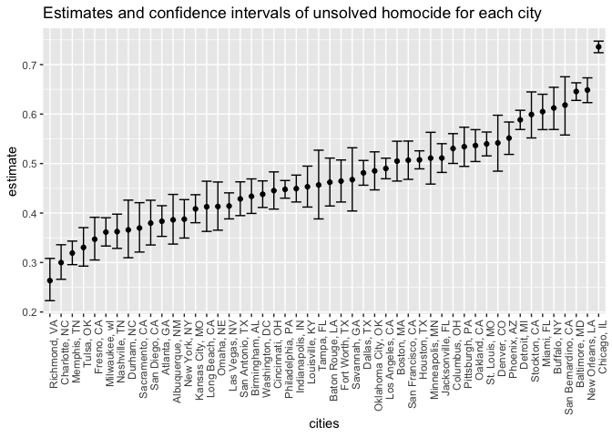
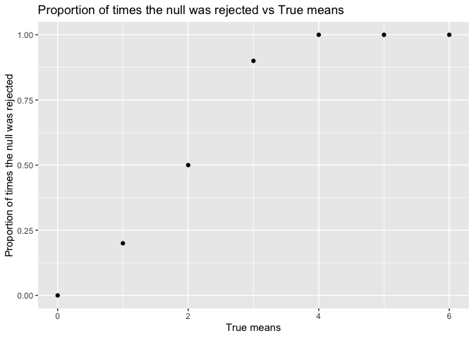
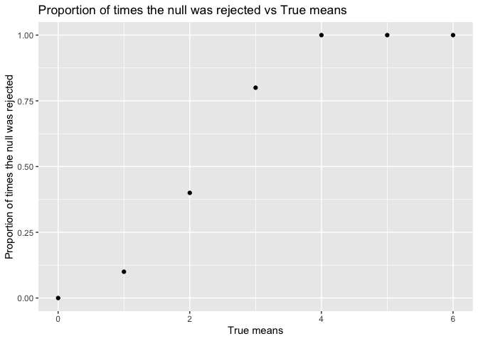
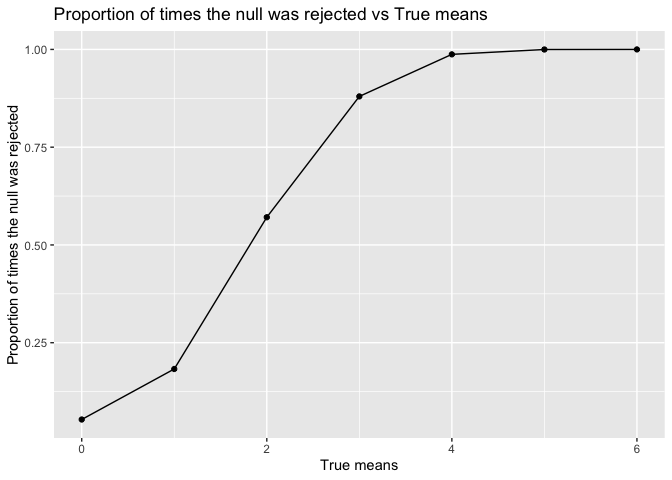

p8105_hw5_yl4610
================
2022-11-08

``` r
library(tidyverse)
library(p8105.datasets)
library(viridis)
```

# problem 1

The code chunk below imports the data in individual spreadsheets
contained in `./data/Q1data/`. To do this, I create a dataframe that
includes the list of all files in that directory and the complete path
to each file. As a next step, I `map` over paths and import data using
the `read_csv` function. Finally, I `unnest` the result of `map`.

``` r
full_df = 
  tibble(
    files = list.files("data/Q1data/"),
    path = str_c("data/Q1data/", files)
  ) %>% 
  mutate(data = map(path, read_csv)) %>% 
  unnest()
```

The result of the previous code chunk isn’t tidy – data are wide rather
than long, and some important variables are included as parts of others.
The code chunk below tides the data using string manipulations on the
file, converting from wide to long, and selecting relevant variables.

``` r
tidy_df = 
  full_df %>% 
  mutate(
    files = str_replace(files, ".csv", ""),
    group = str_sub(files, 1, 3)) %>% 
  pivot_longer(
    week_1:week_8,
    names_to = "week",
    values_to = "outcome",
    names_prefix = "week_") %>% 
  mutate(week = as.numeric(week)) %>% 
  select(group, subj = files, week, outcome)
```

# problem 2

``` r
homicide_raw = read_csv( "./data/homicide_data.csv") 
```

This dataset contains variables such as uid, reported_date, victim_last,
victim_first, victim_race, victim_age, victim_sex, city, state, lat,
lon, disposition. It contains 12 columns and 52179 rows.

``` r
homicide = 
homicide_raw %>% 
  mutate (
    city_state = str_c(city, ", ", state),
    city_state = ifelse(city_state == "Tulsa, AL", "Tulsa, OK", city_state)) %>%
  group_by(city_state) %>% 
  summarize(
    total_homicides = n(),
    unsolved_homicides = sum(disposition !="Closed by arrest"))

homicide
```

    ## # A tibble: 50 × 3
    ##    city_state      total_homicides unsolved_homicides
    ##    <chr>                     <int>              <int>
    ##  1 Albuquerque, NM             378                146
    ##  2 Atlanta, GA                 973                373
    ##  3 Baltimore, MD              2827               1825
    ##  4 Baton Rouge, LA             424                196
    ##  5 Birmingham, AL              800                347
    ##  6 Boston, MA                  614                310
    ##  7 Buffalo, NY                 521                319
    ##  8 Charlotte, NC               687                206
    ##  9 Chicago, IL                5535               4073
    ## 10 Cincinnati, OH              694                309
    ## # … with 40 more rows

I used mutate to create a city_state variable. Then I used group_by and
summarize to summarize within cities to obtain the total number of
homicides and the number of unsolved homicides.

``` r
baltimore = 
  homicide %>% 
  filter(city_state == "Baltimore, MD") 

prop.test(
  baltimore$unsolved_homicides,baltimore$total_homicides) %>% 
  broom::tidy()
```

    ## # A tibble: 1 × 8
    ##   estimate statistic  p.value parameter conf.low conf.high method        alter…¹
    ##      <dbl>     <dbl>    <dbl>     <int>    <dbl>     <dbl> <chr>         <chr>  
    ## 1    0.646      239. 6.46e-54         1    0.628     0.663 1-sample pro… two.si…
    ## # … with abbreviated variable name ¹​alternative

I used filter to filter out other city_state except “Baltimore, MD”.
Then I used prop.test function to estimate the proportion of homicides
that are unsolved and applied the broom::tidy to pull the estimated
proportion and confidence intervals.

``` r
city_final = 
  homicide %>% 
  mutate(
    outputs_df = map2 (unsolved_homicides,total_homicides, prop.test),
    final_outputs_df = map(outputs_df, broom::tidy)) %>% 
  unnest(final_outputs_df) %>% 
  select (city_state, estimate, conf.low, conf.high)

city_final
```

    ## # A tibble: 50 × 4
    ##    city_state      estimate conf.low conf.high
    ##    <chr>              <dbl>    <dbl>     <dbl>
    ##  1 Albuquerque, NM    0.386    0.337     0.438
    ##  2 Atlanta, GA        0.383    0.353     0.415
    ##  3 Baltimore, MD      0.646    0.628     0.663
    ##  4 Baton Rouge, LA    0.462    0.414     0.511
    ##  5 Birmingham, AL     0.434    0.399     0.469
    ##  6 Boston, MA         0.505    0.465     0.545
    ##  7 Buffalo, NY        0.612    0.569     0.654
    ##  8 Charlotte, NC      0.300    0.266     0.336
    ##  9 Chicago, IL        0.736    0.724     0.747
    ## 10 Cincinnati, OH     0.445    0.408     0.483
    ## # … with 40 more rows

I used mutate to run prop.test for each of the cities and extract both
the proportion of unsolved homicides and the confidence interval for
each via purrr::map and purrr::map2. Then I unnested the
final_outputs_df and selected variables I wanted to create a tidy
dataframe with estimated proportions and CIs for each city.

``` r
city_plot = 
city_final %>% 
ggplot(aes(x=fct_reorder(city_state, estimate), y=estimate))+
  geom_point()+
  geom_errorbar(aes(ymin=conf.low, ymax=conf.high))+
  labs(
    title = "Estimates and confidence intervals of unsolved homocide for each city",
    x = "cities") +
  theme(axis.text.x = element_text(angle = 90, hjust = 1))

city_plot
```

<!-- --> I
used ggplot to create a scatter plot showing the estimates and CIs for
each city. I used geom_errorbar to add error bars based on the upper and
lower limits. I used fct_reorder to organize cities according to the
proportion of unsolved homicides. lastly, I used labs to add title and
x-axis label.

# problem 3

``` r
norm_dis = function(n = 30, mu, sigma = 5) {
  norm_data = tibble(
    x = rnorm(n, mean = mu, sd = sigma)) 
  
    norm_data %>% 
    t.test (mu = 0, alpha = 0.05, conf.level = 0.95) %>% 
      broom::tidy ()
}
norm_dis
```

    ## function(n = 30, mu, sigma = 5) {
    ##   norm_data = tibble(
    ##     x = rnorm(n, mean = mu, sd = sigma)) 
    ##   
    ##     norm_data %>% 
    ##     t.test (mu = 0, alpha = 0.05, conf.level = 0.95) %>% 
    ##       broom::tidy ()
    ## }

``` r
norm_results_df = 
  expand_grid(
    mu = 0:6,
    iter = 1:10) %>% 
  mutate(
    estimate_df = map(mu, ~norm_dis(mu=.x))
  ) %>% 
  unnest(estimate_df) 

norm_results_df
```

    ## # A tibble: 70 × 10
    ##       mu  iter estimate statistic p.value param…¹ conf.…² conf.…³ method alter…⁴
    ##    <int> <int>    <dbl>     <dbl>   <dbl>   <dbl>   <dbl>   <dbl> <chr>  <chr>  
    ##  1     0     1   0.0507    0.0503   0.960      29  -2.01    2.11  One S… two.si…
    ##  2     0     2  -0.0178   -0.0191   0.985      29  -1.93    1.89  One S… two.si…
    ##  3     0     3   0.413     0.364    0.718      29  -1.90    2.73  One S… two.si…
    ##  4     0     4  -0.191    -0.210    0.835      29  -2.05    1.67  One S… two.si…
    ##  5     0     5   1.01      1.12     0.272      29  -0.830   2.84  One S… two.si…
    ##  6     0     6  -0.543    -0.638    0.528      29  -2.28    1.20  One S… two.si…
    ##  7     0     7  -0.469    -0.537    0.596      29  -2.26    1.32  One S… two.si…
    ##  8     0     8  -1.29     -1.23     0.227      29  -3.43    0.849 One S… two.si…
    ##  9     0     9   1.46      1.62     0.117      29  -0.387   3.32  One S… two.si…
    ## 10     0    10  -0.781    -0.880    0.386      29  -2.60    1.04  One S… two.si…
    ## # … with 60 more rows, and abbreviated variable names ¹​parameter, ²​conf.low,
    ## #   ³​conf.high, ⁴​alternative

I conducted a simulation in a one-sample t-test with n=30,
mu=0,1,2,3,4,5,6, and sd=5 via function. I generated 5000 datasets. \#
change ite size to 5000 at the end

``` r
plot_prop1 = 
norm_results_df %>%
  group_by(mu) %>%
  summarize(
    sum_pvalue = sum(p.value < 0.05),
    sum_n = n()) %>% 
  mutate (y_value = sum_pvalue/sum_n) %>% 
  ggplot(aes(x = mu, y = y_value)) + 
  geom_point() + 
  labs(title = "Proportion of times the null was rejected vs True means", 
       x = "True means",
       y = "Proportion of times the null was rejected") 

plot_prop1
```

<!-- --> I
used ggplot to create a scatter plot showing the proportion of times the
null was rejected (the power of the test) on the y axis and the true
value of μ on the x axis. As true mean increases, proportion of times
the null was rejected increases. \# effect sizes? correct calculation?

``` r
plot_prop2 = 
norm_results_df %>%
  group_by(mu) %>%
  summarize(ave_estimate_mu = mean(estimate)) %>%
  ggplot(aes(x = mu, y = ave_estimate_mu, group = mu)) + 
  geom_point() + 
  labs(title = "Average estimate of mu hat vs True value of mu", 
       x = "True value of mu", 
       y = "Average estimate of mu hat") 
plot_prop2
```

<!-- --> I
used ggplot to make a plot showing the average estimate of mu hat on the
y axis and the true value of mu on the x axis.

``` r
plot_prop3 = 
norm_results_df %>%
  group_by(mu) %>%
  filter(p.value < 0.05) %>% 
  summarize(ave_estimate_mu = mean(estimate)) %>%
  ggplot(aes(x = mu, y = ave_estimate_mu, group = mu)) + 
  geom_point() + 
  labs(title = "Average estimate of mu hat vs True value of mu", 
       x = "True value of mu", 
       y = "Average estimate of mu hat only in samples for which the null was rejected") 
plot_prop3
```

<!-- -->

I used ggplot to make a second plot showing the average estimate of mu
hat only in samples for which the null was rejected on the y axis and
the true value of mu on the x axis.

The sample average of mu hat across tests for which the null is rejected
is approximately equal to the true value of mu when mu equals to 5 and 6
because as power and effect sizes increase, XXX
